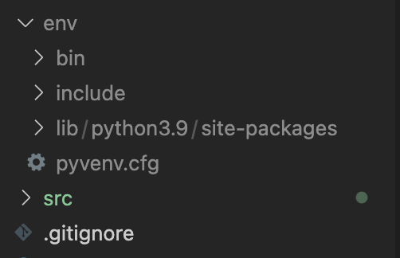
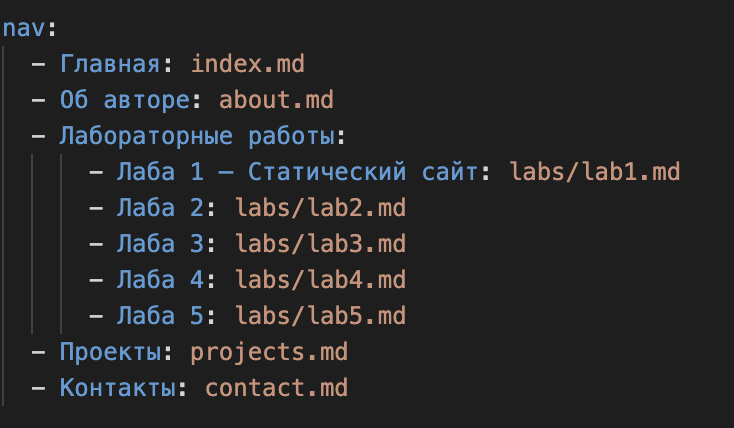

# Лабораторная работа №1

## Тема: Создание и развертывание статического сайта на базе MkDocs с публикацией на GitHub Pages

---

## 📋 Цели работы

- Освоить процесс создания статического сайта с использованием генератора документации MkDocs
- Научиться организовывать структуру документации проекта (портфолио лабораторных работ)
- Изучить базовые принципы работы с системой контроля версий Git и платформой GitHub
- Развернуть статический сайт с использованием механизма GitHub Pages на домене вида `username.github.io`
- Освоить базовую настройку темы оформления и конфигурационного файла `mkdocs.yml`

---

## 📝 Задание

### Основная часть

1. Создать публичный репозиторий на GitHub для размещения сайта-портфолио
2. Настроить GitHub Pages так, чтобы публикация осуществлялась из каталога `/docs` ветки `main`
3. Клонировать репозиторий на локальный компьютер
4. Создать и активировать виртуальное окружение Python
5. Установить MkDocs в виртуальное окружение
6. Настроить файл `.gitignore` (исключить виртуальное окружение, служебные файлы и др.)
7. Создать новый сайт командой:
    ```mkdocs new source```
8. Перейти в каталог source и запустить локальный сервер:
    ```cd source```
    ```mkdocs serve```
9. Выполнить сборку сайта в каталог /docs корня репозитория:
    ```mkdocs build -d ../docs```
10. Выполнить коммит и отправку в удалённый репозиторий (включая каталог source и каталог docs).

### Самостоятельная часть

1. Выбрать и подключить тему оформления (например, dracula, material или иную тему, подходящую для портфолио).
2. Настроить файл mkdocs.yml:
    1. указать название сайта;
    2. задать тему;
    3. реализовать структуру меню через параметр nav.
3. Создать структуру страниц:
    1. Главная страница;
    2. Страница «Об авторе»;
    3. Раздел «Лабораторные работы»;
        1. отдельная страница для каждой лабораторной работы курса;
        2. единый шаблон структуры отчёта (цель, задание, код, выводы).
4. Обеспечить корректную навигацию по сайту.
5. Выполнить повторную сборку и публикацию сайта.

### Требования к оформлению

1. Репозиторий должен быть публичным.
2. Сайт должен быть доступен по адресу вида: https://username.github.io/
3. Структура меню должна быть логичной и иерархической.
4. Должно быть создано не менее 5 страниц.
5. Тема оформления должна быть выбрана осознанно (обоснование выбора — кратко в README).
6. Все изменения должны быть зафиксированы в истории коммитов (минимум 5 осмысленных коммитов).

## Выполнение 

### Создание и настройка публичного репозитория


### Настройка GitHub Pages


### Клонированный репозиторий в VS code


### env и git.ignore



### Структура сайта


### Запуск локального сервера


### Тема оформления 


### Коммиты


### Навигация 



### mkdocs.yml

```markdown
site_name: Статический сайт-портфолио Дениса Кириченко
site_description: Статический сайт-портфолио, созданный с использованием MkDocs и GitHub Pages
site_author: Денис Кириченко
site_url: https://sp4tn1c.github.io  

theme:
  name: material
  language: ru
  palette:
    - media: "(prefers-color-scheme: light)"
      scheme: default
      primary: indigo
      accent: blue
      toggle:
        icon: material/weather-night
        name: Включить тёмную тему
    - media: "(prefers-color-scheme: dark)"
      scheme: slate
      primary: indigo
      accent: blue
      toggle:
        icon: material/weather-sunny
        name: Включить светлую тему
  features:
    - navigation.tabs
    - navigation.sections
    - navigation.expand
    - navigation.indexes
    - search.highlight
    - content.code.copy

nav:
  - Главная: index.md
  - Об авторе: about.md
  - Лабораторные работы:
      - Лаба 1 — Статический сайт: labs/lab1.md
      - Лаба 2: labs/lab2.md
      - Лаба 3: labs/lab3.md
      - Лаба 4: labs/lab4.md
      - Лаба 5: labs/lab5.md
  - Проекты: projects.md
  - Контакты: contact.md

plugins:
  - search:
      lang: ru

markdown_extensions:
  - admonition
  - codehilite:
      guess_lang: false
  - toc:
      permalink: true
  - pymdownx.details
  - pymdownx.superfences
  - attr_list
  - md_in_html
  - pymdownx.emoji:
      emoji_index: !!python/name:material.extensions.emoji.twemoji
      emoji_generator: !!python/name:material.extensions.emoji.to_svg
  - pymdownx.tasklist:
      custom_checkbox: true

extra:
  generator: false
  social:
    - icon: fontawesome/brands/github
      link: https://github.com/sp4tn1c  
    - icon: fontawesome/brands/telegram
      link: https://t.me/sp4tn1c
```

### Повторная сборка и публикация сайта

```bash
>> cd src
>> mkdocs build
```
