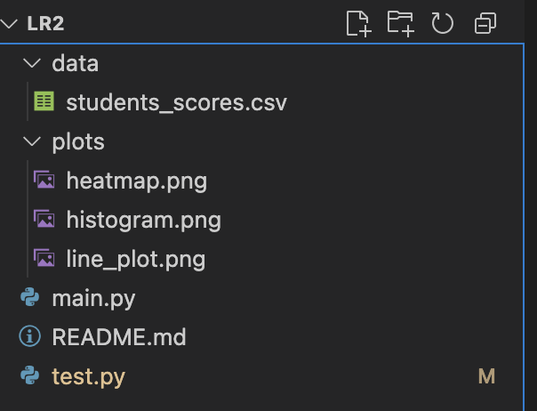
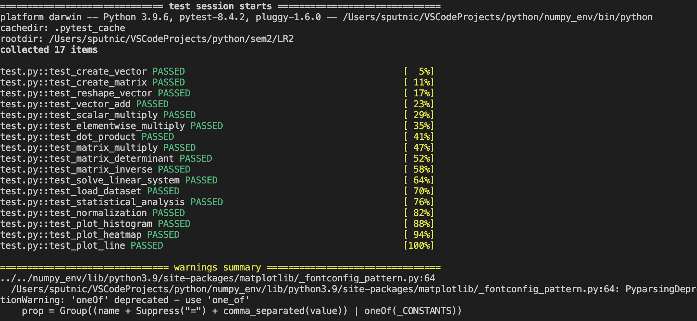
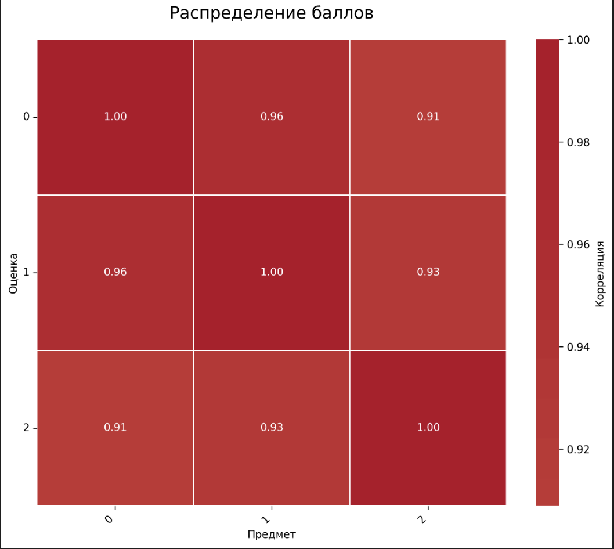
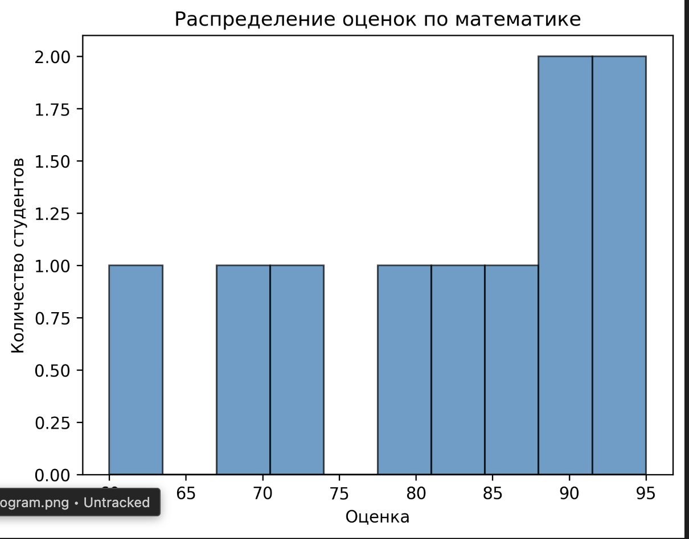
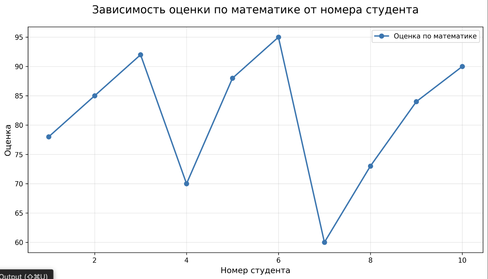

# Лабораторная работа №2

## Тема: Основы NumPy. Массивы и векторные операции

---

## Цели работы

- Освоить библиотеку NumPy для работы с многомерными массивами
- Реализовать функции для:
    - Создания и обработки массивов
    - Выполнения векторных операций
    - Выполнения матричных операций
    - Статистического анализа данных
    - Визуализации результатов
- Написать тесты для проверки корректности всех функций
- Соблюсти стандарты кода: PEP-8, PEP-257, PEP-484
- Задокументировать все функции с использованием docstrings

---

## Основная часть

Я создал виртуальное окружение numpy_env, активировал его, установил
зависимости ```pip install numpy matplotlib seaborn pandas pytest```

### Нюансы работы

1. Для вывода визуализации я отдельно запускал каждую функцию и сохранял
графический результат

2. Лаба находится в репозитории GitHub вместе с лругими лабами за 1 семестр

### Структура проекта
```
lr_2/
├── main.py
├── test.py
├── data/
│ └── students_scores.csv
└── plots/
```



### Тесты



## Визуализация

### Тепловая карта



### Гистограмма 



### Линейный график 

