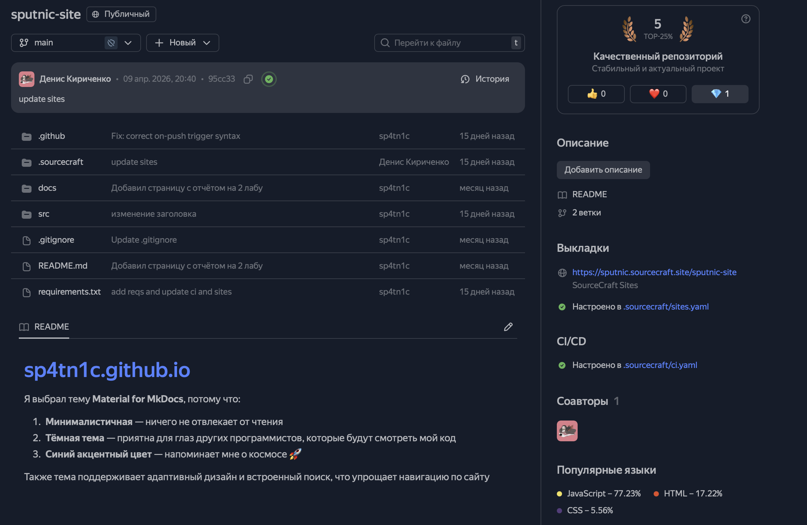

# Лабораторная работа №3

## Тема: Автоматический деплой статического сайта MkDocs в Sourcecraft и GitHub Pages

---

## Цель работы

Реализовать два независимых сценария автоматического развертывания одного и того же статического сайта на MkDocs:

- деплой в Sourcecraft;
- деплой в GitHub Pages через GitHub Actions.

Также требовалось использовать один локальный репозиторий с двумя удаленными `remote`: `origin` (GitHub) и `sourcecraft` (Sourcecraft).

---

## Исходные данные и инструменты

- Локальный репозиторий с проектом на `mkdocs`
- Git и GitHub
- Платформа Sourcecraft
- GitHub Actions

---

## Выполненные действия

### 1) Подготовка Sourcecraft

1. Выполнена авторизация на `sourcecraft.dev` через аккаунт Яндекс.
2. Создана публичная организация.
3. Создан пустой репозиторий для сайта.
4. Создан персональный токен (PAT) с правами `Maintainer` для работы по HTTPS.

### 2) Настройка локального Git-репозитория с двумя remote

В локальном репозитории добавлен второй удаленный репозиторий:

```bash
git remote add sourcecraft https://<yandex_username>:<sourcecraft_pat>@git.sourcecraft.dev/<yandex_username>/<repo_name>.git
```

Проверка:

```bash
git remote -v
```

В результате в списке отображаются:

- `origin` -> GitHub-репозиторий;
- `sourcecraft` -> Sourcecraft-репозиторий.

### 3) Автоматический деплой в Sourcecraft

1. Код сайта загружен в удаленный репозиторий `sourcecraft`.
2. В Sourcecraft выполнена настройка деплоя статического сайта из репозитория.
3. Проверено, что после обновления основной ветки сайт пересобирается и обновляется автоматически.

### 4) Автоматический деплой в GitHub Pages через Actions

1. В репозитории GitHub добавлен workflow для сборки и публикации MkDocs.
2. Workflow запускается при пуше в основную ветку.
3. Сборка документации выполняется автоматически, результат публикуется в GitHub Pages.
4. Проверено, что после пуша изменения появляются на `username.github.io`.

---

## Организация репозитория

Используется один локальный проект и два удаленных репозитория:

- `origin` — основной удаленный репозиторий на GitHub (код + GitHub Actions);
- `sourcecraft` — репозиторий на Sourcecraft для альтернативного канала хостинга.

Логика работы:

1. Изменения вносятся локально.
2. Коммиты отправляются в `origin` и при необходимости в `sourcecraft`.
3. На стороне GitHub и Sourcecraft срабатывают свои механизмы деплоя.

---

## Что нужно сделать для запуска деплоя 

### Для Sourcecraft

1. Сгенерировать персональный токен (PAT) сроком на полгода с правами `Maintainer` для работы по HTTPS.
2. Добавить `remote sourcecraft`.
3. Отправить код в Sourcecraft-репозиторий.
4. В интерфейсе Sourcecraft включить/настроить деплой статического сайта.

### Для GitHub Pages

1. Создать/добавить workflow GitHub Actions для MkDocs.
2. Включить GitHub Pages в настройках репозитория.
3. Указать источник публикации из GitHub Actions.
4. Выполнить пуш в основную ветку и дождаться успешного workflow.

---

## Какие настройки были сделаны в интерфейсах платформ

### Настройки GitHub

- Включен GitHub Pages для репозитория.
- Источник публикации: `GitHub Actions`.
- Добавлен workflow для сборки и деплоя MkDocs.
- Проверен успешный статус workflow в разделе `Actions`.

### Настройки Sourcecraft

- Создан публичный репозиторий в организации.
- Настроен доступ по HTTPS с PAT.
- Подключен сценарий/механизм публикации статического сайта.
- Проверена доступность сайта по публичному URL.

---

## Результаты (ссылки)


1. Статический сайт на Sourcecraft:  
   `https://sputnic.sourcecraft.site/sputnic-site/`
2. Репозиторий Sourcecraft:  
   `https://sourcecraft.dev/sputnic/sputnic-site`
3. Статический сайт на GitHub Pages:  
   `https://sp4tn1c.github.io/`
4. Репозиторий GitHub:  
   `https://github.com/sp4tn1c/sp4tn1c.github.io.git`

---

## Визуализация

1. **Sourcecraft: созданная организация и репозиторий**  
   

2. **Создание PAT в Sourcecraft**  
   Экран параметров токена (без отображения самого значения токена).

3. **Локальная проверка remote**  
   Терминал с командой `git remote -v`, где видны `origin` и `sourcecraft`.

4. **Файл workflow GitHub Actions**  
   Скриншот файла workflow в репозитории GitHub (`.github/workflows/...`).

5. **Успешный запуск GitHub Actions**  
   Экран вкладки `Actions` со статусом `Success`.

6. **Настройки GitHub Pages**  
   Экран `Settings -> Pages`, где выбран источник `GitHub Actions`.

7. **Открытый сайт на GitHub Pages**  
   Страница `https://<github_username>.github.io/` в браузере.

8. **Открытый сайт на Sourcecraft**  
   Страница `https://<yandex_username>.sourcecraft.site/<repo_name>/` в браузере.

9. **(Опционально) История коммитов/пушей в оба репозитория**  
   Для подтверждения синхронизации локального проекта с двумя remote.

---

## Вывод

В ходе лабораторной работы реализованы два сценария автоматического деплоя одного MkDocs-сайта: через Sourcecraft и через GitHub Actions (GitHub Pages).  
Задача выполнена в рамках одного локального репозитория с двумя удаленными репозиториями (`origin` и `sourcecraft`), что подтверждает корректную организацию процесса публикации в двух независимых платформах.